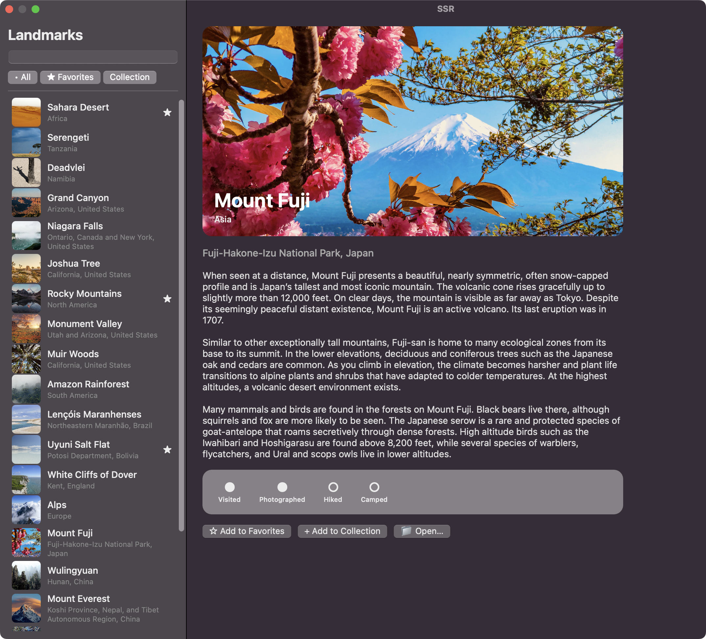

# SSR — Scala ↔ Swift RPC UI

A proof-of-concept FRP UI framework for native-looking macOS apps, written in Scala. A Swift `AppKit` host process renders the UI; a Scala child process owns application logic and the component tree. The two communicate over JSON-RPC (LSP framing) on stdin/stdout, with the wire protocol defined in Smithy.

The component DSL is shamelessly inspired by [Calico](https://www.armanbilge.com/calico/) — `Resource[IO, _]`-based components, `Signal`-driven reactivity, the same `:=` / `<--` split for static vs. reactive attributes.

> Status: experimental / early days. The library and packaging plugin are published to Maven Central under `com.kubukoz`, but the API is unstable and there are no compatibility guarantees yet.



## What it looks like

The DSL composes AppKit nodes with `cats-effect` `Resource` and `fs2` `Signal`. Here's a slice of the Landmarks sidebar:

```scala
ui.vstack(
  styles.padding := EdgeInsets.only(top = 40, leading = 12, bottom = 12, trailing = 12),
  styles.spacing := 10,
  styles.background := Background.material(Material.Sidebar),
  ui.label(
    "Landmarks",
    styles.font := Font.system(22, FontWeight.Bold),
  ),
  ui.textfield(
    attrs.value <-- query,
    onInput(query.set),
  ),
  ui.divider,
  ui.scrollview(
    ui.vstack(
      styles.spacing := 2,
      ui.children[Int](id => row(byId, id, selected)) <-- visibleIds,
    )
  ),
)
```

A row driven entirely by signals — the image, title and subtitle all swap when the underlying `Landmark` changes:

```scala
ui.hstack(
  styles.padding := EdgeInsets.symmetric(horizontal = 6, vertical = 4),
  styles.spacing := 10,
  ui.image(
    attrs.value <-- landmark.map(l => s"${l.imageName}-thumb"),
    styles.frame := Frame.fixed(44, 44),
    styles.cornerRadius := 6,
  ),
  ui.vstack(
    styles.spacing := 2,
    styles.alignment := Alignment.Leading,
    ui.label(landmark.map(_.name), styles.font := Font.system(14, FontWeight.Medium)),
    ui.label(landmark.map(_.park),  styles.font := Font.system(11), styles.foreground := Color.hex("#888888")),
  ),
  ui.spacer,
  ui.label(landmark.map(l => if (l.isFavorite) "★" else "")),
  onClick(selected.set(Some(id))),
)
```

Keyed children swap detail bodies cleanly when the selection changes — when the key changes the previous body is released and a fresh one is allocated:

```scala
ui.children[Option[Int]] {
  case None     => welcome(byId, all, selected)
  case Some(id) => landmark(byId, id, all, collection, openPanelResult, emit)
} <-- selected.map(List(_))
```

Bidirectional RPC works too — Scala can call Swift for things like an open panel and `await` the chosen path:

```scala
ui.button(
  "📁 Open…",
  onClick(
    emit
      .openPanel(title = Some("Choose a file"))
      .flatMap(out => openPanelResult.set(out.path))
  ),
)
```

App entry point:

```scala
object LandmarksMain extends SSRApp {
  def render(ctx: SSR): Resource[IO, App] =
    for {
      // … signalling refs …
    } yield App(
      window = Signal.constant(window),
      menu = Signal.constant(menu),
      component = ui.splitview(sidebar = Sidebar.render(...), detail = Detail.render(...)),
    )
}
```

## Using it

SSR ships as two artifacts on Maven Central, both under `com.kubukoz` and pinned to the same version:

| Artifact | What it is |
| --- | --- |
| `com.kubukoz %%% ssr` | The library — the `ui` DSL, FRP runtime and JSON-RPC client (JVM **and** Scala Native). |
| `com.kubukoz % sbt-ssr` | The sbt plugin that packages your app into a macOS `.app`. |

### 1. Write an app against the library

```scala
// build.sbt
libraryDependencies += "com.kubukoz" %%% "ssr" % "0.1.0"
```

Implement an `SSRApp` (see the `LandmarksMain` sketch above and the [demos](scala/demos) for full examples). During development you don't need to package anything — the plugin's dev tasks build the Swift host locally and launch it against your child process.

### 2. Package it into a `.app`

Add the plugin and enable it on your app module:

```scala
// project/plugins.sbt
addSbtPlugin("com.kubukoz" % "sbt-ssr" % "0.1.0")
```

```scala
// build.sbt — on the module that produces your Scala child
enablePlugins(SsrPlugin)

ssrAppName     := "Landmarks"
ssrChildBinary := (Compile / nativeLink).value          // Scala Native output, or a JVM launcher script
ssrAssetsDir   := Some(baseDirectory.value / "assets")  // optional; staged under Resources/assets/
```

Then:

```bash
sbt ssrPackage   # assembles target/Landmarks.app
```

`ssrPackage` lays the bundle out to the contract the Swift host expects — the child as `Contents/Resources/ssr-child`, assets under `Contents/Resources/assets/`, and the host as the bundle executable.

**Where the Swift host comes from.** By default the plugin downloads the prebuilt `ssr-app` binary from this repo's GitHub release matching your `ssr` version (`SsrHostSource.Release`). You can point it elsewhere:

```scala
import ssr.sbt.SsrPlugin.SsrHostSource

// use a host binary you built yourself:
ssrHostSource := SsrHostSource.LocalPath(file("/path/to/ssr-app"))

// or build it from Swift sources on the spot (needs swiftc):
ssrHostSource := SsrHostSource.LocalBuild(file("swift"), product = "ssr-host")
```

### Using scala-cli instead of sbt

The child is just a normal executable that speaks JSON-RPC over stdio, so you can write and build it with [scala-cli](https://scala-cli.virtuslab.org/) — no sbt needed for the app itself. `sbt-ssr` is sbt-only, so with scala-cli you drive the host directly (via `SCALA_APP_BIN`) instead of producing a `.app`.

```scala
//> using scala 3.8.3
//> using dep com.kubukoz::ssr:0.1.0        // JVM
// native: //> using platform native  +  //> using dep com.kubukoz::ssr::0.1.0

import cats.effect.*
import fs2.concurrent.Signal
import ssr.*
import ssr.internal.protocol.SetWindowInput

object MyApp extends SSRApp {          // SSRApp is an IOApp.Simple — no main needed
  def render(ctx: SSR): Resource[IO, App] =
    Resource.pure(
      App(
        window = Signal.constant(SetWindowInput(width = 480, height = 320)),
        menu = Signal.constant(Nil),
        component = ui.label("hello from scala-cli"),
      )
    )
}
```

Build the child, grab a host binary (from this repo's [releases](https://github.com/kubukoz/scala-swift-rpc/releases), or build `swift/`), and launch the host pointed at the child:

```bash
# JVM: a runnable launcher for the child
scala-cli --power package app.scala -o my-app --assembly
# (or native:  scala-cli --power package app.scala -o my-app --native)

SCALA_APP_BIN="$PWD/my-app" \
SSR_ASSETS_DIR="$PWD/assets" \
  ./ssr-app          # the Swift host — it spawns $SCALA_APP_BIN as the child
```

`SCALA_APP_BIN` / `SSR_ASSETS_DIR` are the same env vars `sbt runJVM` uses; the host falls back to the `.app` bundle layout only when they're unset. This is the lightest way to iterate on a child app.

## Building this repo

To hack on SSR itself (clone-and-run):

```bash
sbt runJVM     # build everything and launch with the JVM Scala child
sbt runNative  # same, but the Scala Native child
```

Requires `sbt` and `swiftc`. See [CLAUDE.md](CLAUDE.md) for the architecture deep-dive — process model, mount/patch lifecycle, FRP runtime details, publishing setup and conventions.
